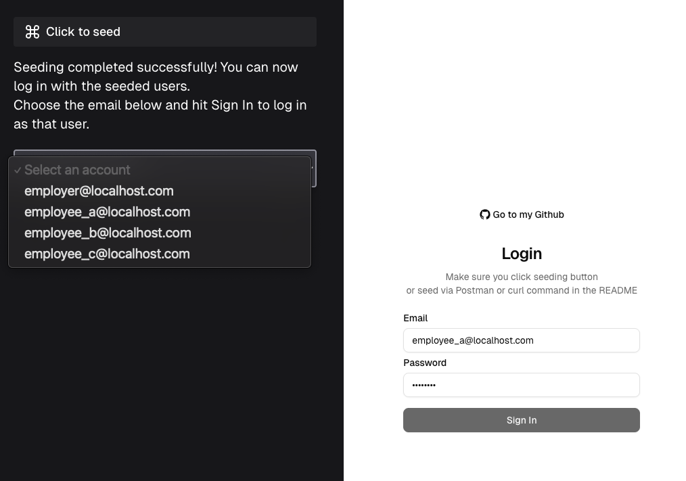
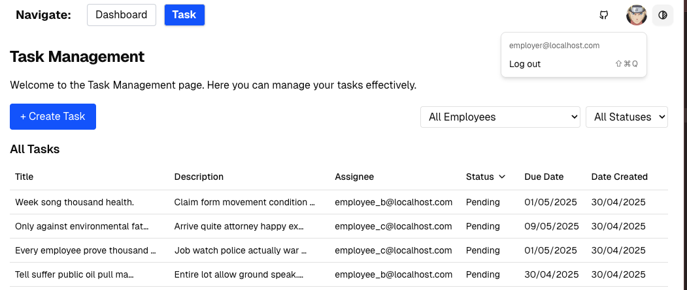
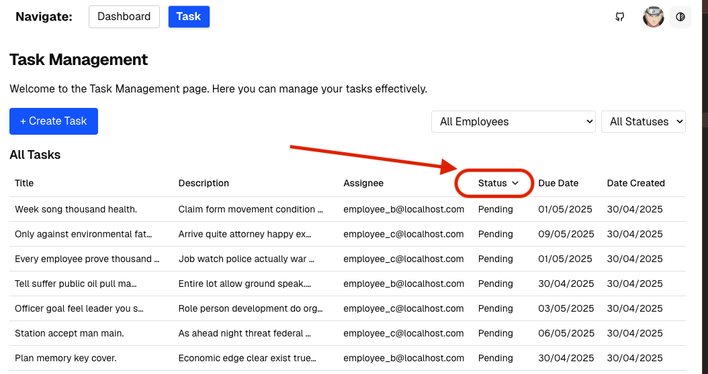

# Project Task Management
## Description
This project is a task management system that allows employer to create, update, and assign tasks to the employees. It also includes features for user authentication and authorization, as well as a user-friendly interface for managing tasks.
## Technologies Used
- Docker
- Django
- Django REST Framework
- PostgreSQL
- NextJS in TypeScript
- Zustand
- Tailwind CSS

## Prequisites
- Docker
- Docker Compose Plugin

## Setup Instructions
1. Run the following command to copy environment variables:
    ```bash
    cp .env.example .env && docker compose down && docker compose up -d --build
    ```

2. To run the tests, execute the following command:
    ```bash
    docker compose exec backend sh -c "DJANGO_SETTINGS_MODULE=config.settings.test pytest"
    ```

## Specifications
- All specifications can be found in the test functions of the test folders `backend/tests/integration/tasks`

## Notices
- There is a seeding button on the UI to click on or using the following command:
  ```bash
  curl --location --request POST 'http://localhost:8000/api/seed/all/'
  ```
  
- Logout: click on the avatar to logout.
  
- Sorting when clicking on the last three columns' headers.
  